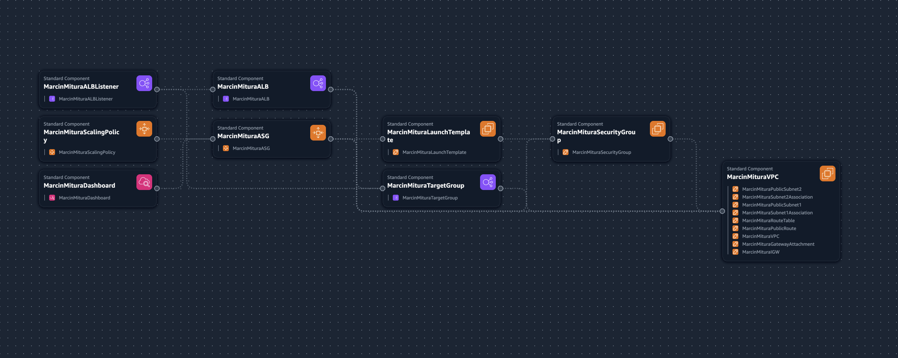
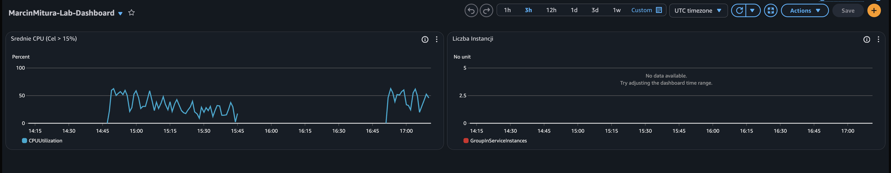
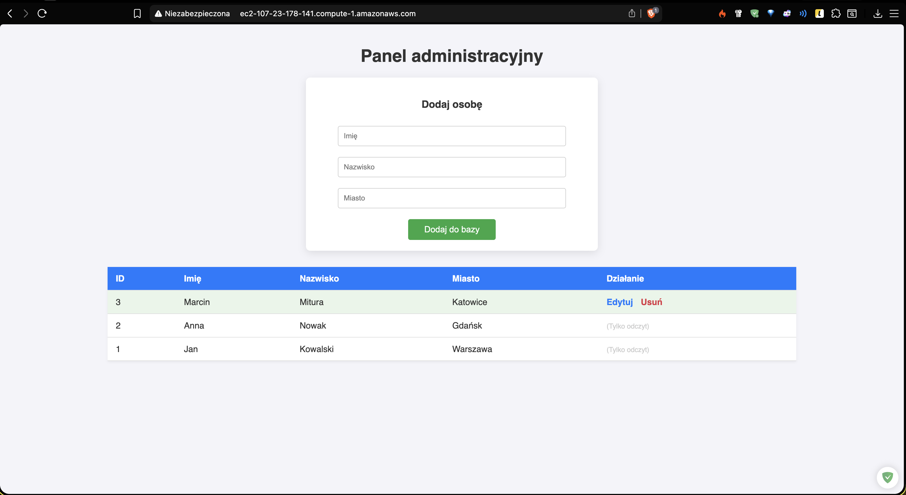

# AWS Cloud Computing Labs ☁️

Kompletne repodzytorium zawierające projekty infrastruktury w kodzie (IaC) zrealizowane w ramach przedmiotu **Cloud Computing II**.

Projekt demonstruje ewolucję od ręcznego zarządzania zasobami, przez skrypty CLI, aż po pełną automatyzację z wykorzystaniem **AWS CloudFormation**, **Auto Scaling Groups** oraz architektury dwuwarstwowej (**2-Tier Architecture**) z bazą danych RDS.

Ten projekt jest udostępniony na licencji [MIT](./LICENSE.md). Możesz go swobodnie używać do nauki i rozwoju własnych projektów.


## 📂 Struktura projektu

Repozytorium zostało podzielone na logiczne moduły odpowiadające kolejnym etapom laboratoriów.

```sh
~/AWS Cloud Computing Labs
├── infrastructure/                     # Szablony CloudFormation (YAML) - Serce projektu
│   ├── 01_vpc_setup.yaml               # Lab 1: Konfiguracja sieci (VPC, Subnets, IGW)
│   ├── 02_ec2_web_server.yaml          # Lab 2: Serwer WWW z UserData (Bootstrapping)
│   ├── 04_alb_setup.yaml               # Lab 4: Application Load Balancer
│   ├── 05_asg_stress_test.yaml         # Lab 5: Auto Scaling & Logic Stress Test
│   └── 06_rds_web_architecture.yaml    # Lab 6: Architektura 2-Tier (EC2 + RDS)
│
├── src/                      # Kod źródłowy aplikacji webowej (Lab 6)
│   └── web-app/              # Panel administracyjny CRUD (PHP/HTML)
│
├── scripts/                  # Skrypty pomocnicze
│   └── alb-test.sh           # Testowanie Load Balancera
│
└── images/                   # Dokumentacja wizualna (Zrzuty ekranu)
```

## 🚀 Przegląd Laboratoriów

### Lab 1-3: Fundamenty

* Konfiguracja sieci VPC, podsieci publicznych/prywatnych oraz tablic routingu.
* Zarządzanie pamięcią masową S3 z poziomu AWS CLI.

### Lab 4: Load Balancing (ALB)

* Wdrożenie **Application Load Balancer** w modelu Multi-AZ.
* Konfiguracja *Target Groups* oraz *Health Checks*.

### Lab 5: Auto Scaling & Monitoring

* Implementacja **Auto Scaling Group** z polityką *Target Tracking* (CPU > 15%).
* **Custom User Data Logic:** Instancje posiadają zaszytą logikę w PowerShell, która generuje obciążenie CPU w zależności od parzystości adresu IP, co pozwala przetestować automatyczne skalowanie.
* Monitoring z wykorzystaniem **CloudWatch Dashboards**.

### Lab 6: Architektura Dwuwarstwowa

* Integracja serwera aplikacji (EC2 Windows + XAMPP) z zarządzaną bazą danych **Amazon RDS (MySQL)**.
* Aplikacja Webowa (PHP) realizująca pełny cykl **CRUD** (Create, Read, Update, Delete).
* Pełna izolacja bazy danych w podsieci prywatnej.

## 🛠️ Jak uruchomić (Deployment)

Wszystkie szablony w folderze `infrastructure` są gotowe do wdrożenia ("Production Ready").

1. Zaloguj się do konsoli AWS.
2. Przejdź do usługi **CloudFormation**.
3. Wybierz opcję **Create stack** -> **Upload a template file**.
4. Wybierz odpowiedni plik YAML z katalogu `infrastructure/`.
5. Postępuj zgodnie z instrukcjami kreatora (parametry domyślne są skonfigurowane).

## 📸 Galeria

Pełna dokumentacja wizualna (zrzuty ekranu z weryfikacji) znajduje się w folderze `images/`.

| Architektura ASG                          | Panel CloudWatch                                   | Aplikacja CRUD                            |
|:------------------------------------------|:---------------------------------------------------|:------------------------------------------|
|  |  |  |

---

Stworzono z myślą o nauce i rozwoju 😄

**Autor:** Marcin Mitura

**Data:** 2026-01-23
