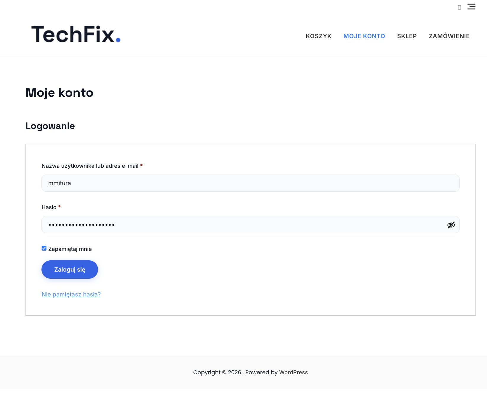
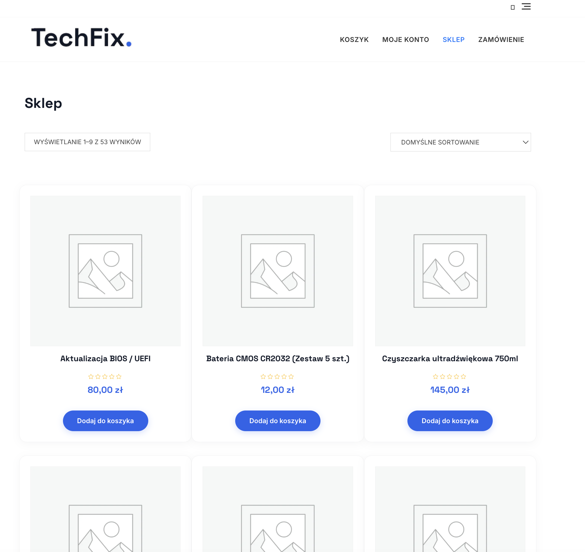
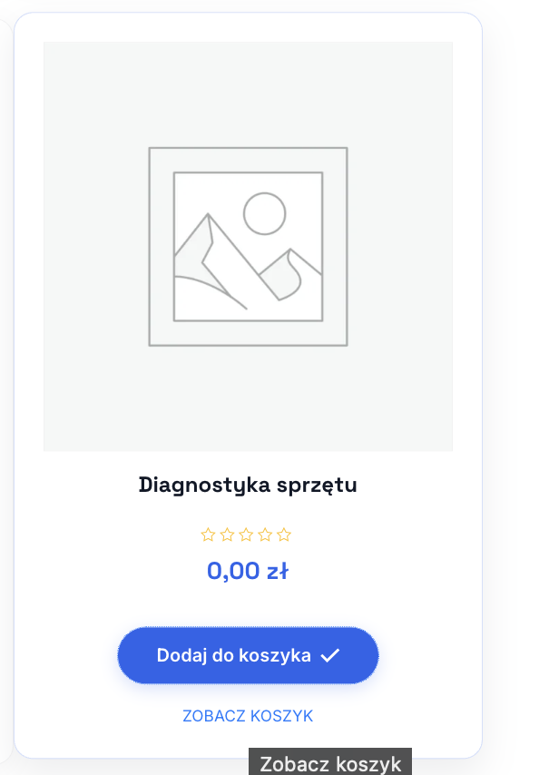
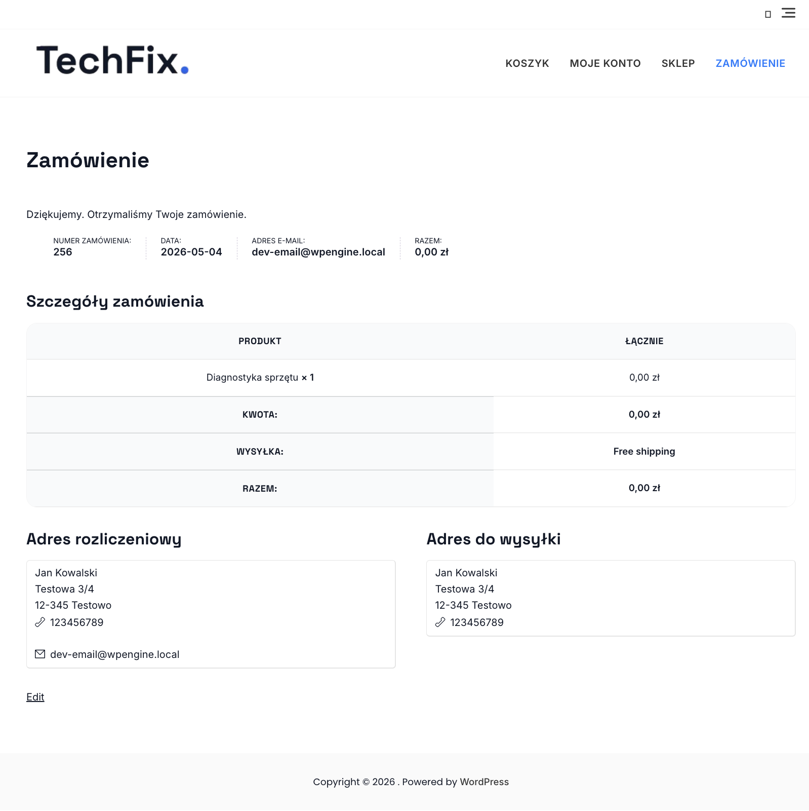

# AWS Cloud Computing Labs

   

Projekt ten jest objęty licencją [MIT](./LICENSE.md).

## Struktura projektu

```sh
~/AWS-Cloud-Computing-Labs
├── infrastructure/
│   ├── AWS-WP-WooCommerce.yaml
├── src/
│   ├── assets/
│   │   ├── TechFix_Products.csv
│   │   └── favicon-techfix.png
│   └── backups/
├── scripts/
├── images/
│   ├── LoginWindow.png
│   ├── MainShopPage.png
│   ├── OrderConfirmation.png
│   └── ProductInCart.png
└── LICENSE.md
```

## Kluczowe cechy

- Wysoka dostępność: ALB + ASG + RDS Multi-AZ
- Trwałość danych: EFS dla `wp-content` oraz backupy w `src/backups`
- Bootstrapping: UserData konfiguruje instancje przy starcie
- Skalowanie: ASG z politykami opartymi na metrykach

## Szybki start (Deployment)

1. Otwórz konsolę AWS → CloudFormation.
2. Create stack → Upload a template file → wybierz szablon z `infrastructure/`.
3. Uzupełnij parametry (nazwa bazy, użytkownik, hasło) i uruchom stack.
4. Po zakończeniu sprawdź *Outputs* — znajdziesz tam URL aplikacji i inne wartości.

### Import projektu WordPress

> [!NOTE]
> Po zaimportowaniu projektu, dane logowania do panelu WordPress to `mmitura` / `cuhwy6-sohXib-qacniq`.
>

1. Zaloguj się do panelu WordPress (URL z `Outputs`).
2. Zainstaluj wtyczkę **All-in-One WP Migration**.
3. Zaimportuj plik `.wpress` z `src/backups/`.

## Galeria

| Ekran logowania | Strona produktu | Produkt dodany do koszyka | Potwierdzenie zamówienia |
|:---------------:|:---------------:|:-----:|:----------------------:|
|  |  |  |  |

---

Stworzono z myślą o nauce i rozwoju 😄

**Autor:** Marcin Mitura

**Data:** `2026-05-04`